Founder and AI engineer building AI agent systems that work in real enterprise environments.

**TETRAPOD** — On-premises AI agents that connect enterprise data, tools, and approval workflows.

 

<h3><code>rhtmdgks@github ~ $ ./contributions.sh</code></h3>

 
 

<h3><code>rhtmdgks@github ~ $ whoami</code></h3>

<table>
<tr>
<td valign="top"></td>
<td valign="top"></td>
</tr>
</table>

